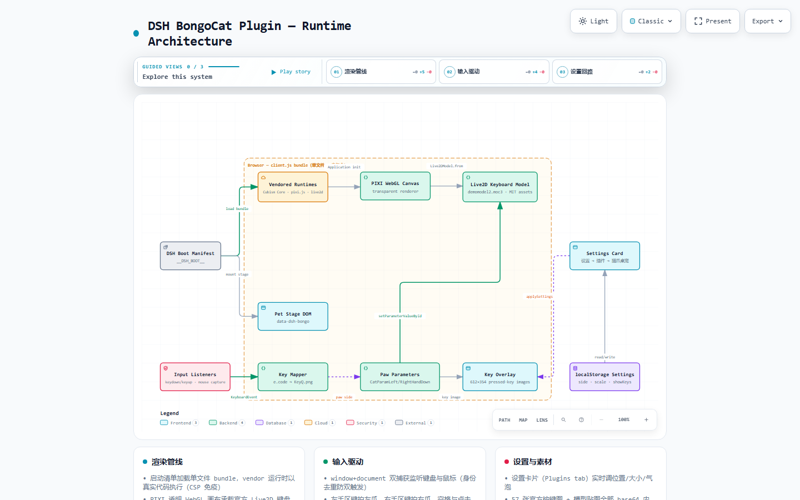

# @deepseek-ai/dsh-client-ui-bongocat

[English](README.md) | 中文

**猫爪桌宠（Live2D 版）**：把 [BongoCat 桌面版](https://github.com/ayangweb/BongoCat)（MIT）的**原版 Live2D 键盘模型**搬进 DeepSeek Harness 网页——同一只猫、同一块键盘，打字时左右爪跟着拍，眼睛自动眨、身体自动呼吸。

## 架构

[](docs/architecture.html)

可交互架构地图——点击图片打开完整 HTML（深浅主题、节点搜索、引导视图：渲染管线 / 输入驱动 / 设置回路）。基于插件真实数据流，使用 [Archify](https://github.com/tt-a1i/archify) 生成。
## 特性

- **原版 Live2D 模型**：内嵌 BongoCat v1.1.0 的 keyboard 模型（moc3 + 官方贴图），Cubism Core + pixi.js + pixi-live2d-display 渲染，全部自包含、零外网请求
- **原版驱动链**：与桌面版相同——按键写入模型参数 `CatParamLeftHandDown` / `CatParamRightHandDown`，左手区键拍左爪、右手区键拍右爪、空格/鼠标左键双爪齐拍
- **活体细节**：自动眨眼、呼吸起伏（模型自带，非预制动画）
- **按键气泡**：按下的键以键帽气泡弹出渐隐（最多 7 个）；密码/token 输入框**始终显示 •••**，也可整体关闭气泡
- **自由摆放**：左下/右下角，50%–180% 缩放；`pointer-events: none` 不挡任何操作
- 一键开关：关闭即销毁模型与 WebGL 上下文，无残留

## 安装（Windows）

```powershell
# 插件目录已就位时，只需链接 + 注册（幂等）：
$DshHome = "$env:USERPROFILE\.dsh"
$src = "<本仓库路径>"
$dest = "$DshHome\plugins\@deepseek-ai\dsh-client-ui-bongocat"
New-Item -ItemType Directory -Force -Path (Split-Path $dest) | Out-Null
Copy-Item "$src\*" $dest -Recurse -Force
$link = "$DshHome\profiles\node_modules\@deepseek-ai\dsh-client-ui-bongocat"
New-Item -ItemType Directory -Force -Path (Split-Path $link) | Out-Null
New-Item -ItemType Junction -Path $link -Target $dest | Out-Null
```

然后往 `$DshHome\profiles\web\cordis.patch.yml` 追加：

```yaml
- insert:
    - id: ui-bongocat
      name: '@deepseek-ai/dsh-client-ui-bongocat'
```

刷新 Web 界面即可。

## 使用

刷新后默认开启。总开关在 **设置 → 插件 → 猫爪桌宠**；位置/大小/按键气泡在 **设置 → 通用设置 → 外观** 下方（玻璃主题调节行下面）。

## 与桌面版 BongoCat 的差别

浏览器插件无法监听系统全局键鼠（只有原生应用可以），本插件监听的是**DSH 页面内**的输入——你在这个界面聊天打字时猫爪实时联动，切到其他应用则不会触发。想要全局版请用桌面版 [BongoCat](https://github.com/ayangweb/BongoCat)。

## License

MIT
